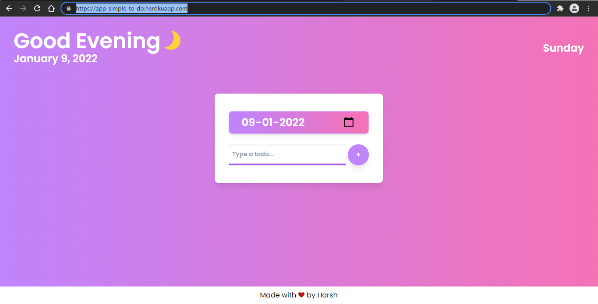

## Simple-to-do-App

Simple-to-do is an application where we can manage our todos. We can add, delete and mark the todos done for a specific date. See it live: https://app-simple-to-do.herokuapp.com/

## Built Using:

- Express.js
- EJS(Template Engine)
- MongoDB
- Tailwind CSS

## Project Screeshots:

## Installation and Setup Instructions(Running Locally):

Clone down this repository. You will need `node` and `npm` installed globally on your machine. You also need to have `mongodb` installed on 
your machine. Software installation links are mentioned below, you can download the suitable versions from here:

- https://nodejs.org/en/download/ - Node.js (If node is installed npm will automatically be present there on your machine).
- https://docs.mongodb.com/manual/installation/ - MongoDB

After you have successfully downloaded the softwares and cloned the repository, go to the app.js file and on the line no. 15 under the connect 
method(mongoose.connect()) provide `mongodb://localhost:27017/simpleTodoDB` in double quotes. 27017 is the port number. If in your case mongoDB listens to a 
different port then just enter that.

Installation:

`npm install`

Run the server:

`node app.js`

To Visit App:

`localhost:3000/`

Till the next time, cheers and
#### Happy Coding! 😊
